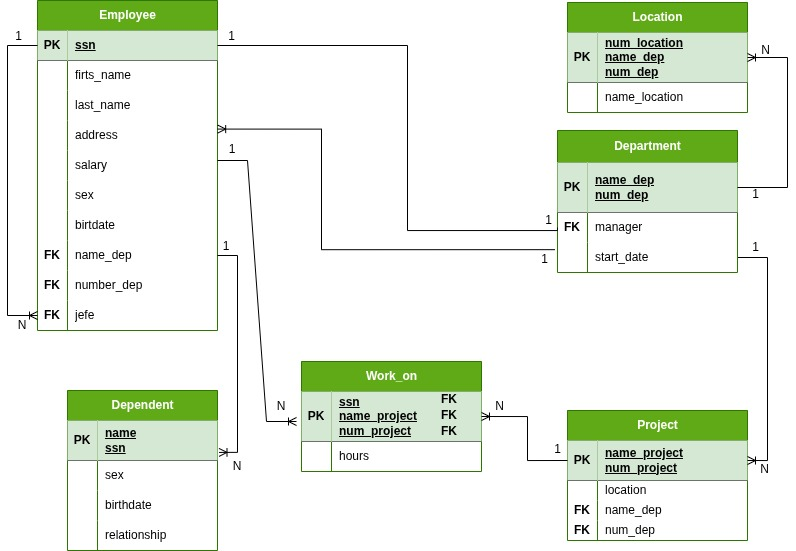

# Diccionario de Datos de la BD CompanyV1

## 1. Información General

| Elemento | Valor |
| :--- | :--- |
|Proyecto|Company v1|
|Version|1.0|
|Fecha|Julio 2026|
|Elaboro|Jose Domingo Sarabia Hernandez|
|SGBD|SQLServer|

## 2. Descripción del Sistema de Base de Datos

El sistema administra la estructura orgánica y de recursos humanos de la corporación. Controla la adscripción de los empleados a sus respectivos departamentos, la localización geográfica de las sucursales, la asignación de horas de trabajo en proyectos de desarrollo y el registro de familiares beneficiarios para prestaciones de seguros médicos. 

La característica principal de este esquema es que el lazo jerárquico central y la identidad de todo el personal se fundamenta en el Número de Seguridad Social (SSN).
## 3. Catalogo de restricciones utilizadas

| Codigo | Significado |
| :--- | :--- |
|PK|PRIMARY KEY|
|FK|FOREIGN KEY|
|NN|NOT NULL|
|UQ|UNIQUE|
|AI|AUTO INCREMENT|
|CK|CHECK|
|DF|DEFAULT|

### Tabla: Employee
**Descripción:** Tabla que detalla todas las caracteristicas de un empleado en la tabla `Employee` 

| Campo | Tipo | Longitud | Restricciones | Descripción |
| :--- | :--- | :--- | :--- | :--- |
| **ssn** | VARCHAR | 15 | PK, NN | Número de seguridad social (Clave natural de identidad). |
| **firts_name** | VARCHAR | 50 | NN | Nombre propio del empleado. |
| **last_name** | VARCHAR | 50 | NN | Apellidos del empleado. |
| **address** | VARCHAR | 150 | NULL | Dirección de residencia física. |
| **salary** | DECIMAL | 10,2 | NN, CK(>0) | Salario mensual asignado. |
| **sex** | CHAR | 1 | NN, CK('M','F')| Género biológico del trabajador. |
| **birtdate** | DATE | - | NN | Fecha de nacimiento. |
| **name_dep** | VARCHAR | 50 | FK, NN | Nombre del departamento al que pertenece. |
| **number_dep** | INT | - | FK, NN | Número correlativo del departamento asignado. |
| **jefe** | VARCHAR | 15 | FK, NULL | SSN del supervisor o gerente directo (Relación recursiva). |

### Tabla: Department
**Descripción:** Tabla que detalla todas las caracteristicas de un departamento de una empresa

| Campo | Tipo | Longitud | Restricciones | Descripción |
| :--- | :--- | :--- | :--- | :--- |
| **name_dep** | VARCHAR | 50 | PK, NN | Nombre único del departamento académico/operativo. |
| **num_dep** | INT | - | PK, NN | Número único de control del departamento. |
| **manager** | VARCHAR | 15 | FK, NN | SSN del empleado que funge como mánager actual. |
| **start_date** | DATE | - | NN, DF(GETDATE())| Fecha de toma de posesión del cargo de mánager. |

### Tabla: Location
**Descripción:** Tabla de relación 1:N que detalla las locaciones de `Department`

| Campo | Tipo | Longitud | Restricciones | Descripción |
| :--- | :--- | :--- | :--- | :--- |
| **num_location** | INT | - | PK, NN | Identificador de la ubicación de la sede. |
| **name_dep** | VARCHAR | 50 | PK, FK, NN | Nombre del departamento ubicado en la sede. |
| **num_dep** | INT | - | PK, FK, NN | Número del departamento ubicado en la sede. |
| **name_location** | VARCHAR | 100 | NN | Nombre geográfico descriptivo del lugar. |

### Tabla: Project
**Descripción:** Tabla que tiene todas las carateristicas de un proyecto que incluyen llaves foraneas de la tabla `Department`

| Campo | Tipo | Longitud | Restricciones | Descripción |
| :--- | :--- | :--- | :--- | :--- |
| **name_project** | VARCHAR | 100 | PK, NN | Nombre oficial y único asignado al proyecto. |
| **num_project** | INT | - | PK, NN | Número de control único del proyecto. |
| **location** | VARCHAR | 100 | NN | Sede o locación donde se desarrolla el proyecto. |
| **name_dep** | VARCHAR | 50 | FK, NN | Nombre del departamento que financia/controla. |
| **num_dep** | INT | - | FK, NN | Número del departamento que financia/controla. |

### Tabla: Work_on
**Descripción:** Tabla de relación N:N que detalla en que projecto trabaja un empleado

| Campo | Tipo | Longitud | Restricciones | Descripción |
| :--- | :--- | :--- | :--- | :--- |
| **ssn** | VARCHAR | 15 | PK, FK, NN | SSN del empleado asignado a la célula de trabajo. |
| **name_project** | VARCHAR | 100 | PK, FK, NN | Nombre del proyecto en el cual colabora. |
| **num_project** | INT | - | PK, FK, NN | Número del proyecto en el cual colabora. |
| **hours** | DECIMAL | 5,2 | NULL, CK(>=0) | Horas semanales invertidas reportadas en el proyecto. |

### Tabla: Dependent
**Descripción:** Tabla que detalla las caracteristicas del dependiente de un `Employee`
| Campo | Tipo | Longitud | Restricciones | Descripción |
| :--- | :--- | :--- | :--- | :--- |
| **name** | VARCHAR | 100 | PK, NN | Nombre completo del familiar dependiente. |
| **ssn** | VARCHAR | 15 | PK, FK, NN | SSN del empleado titular que brinda la cobertura. |
| **sex** | CHAR | 1 | NN, CK('M','F')| Género del familiar dependiente. |
| **birthdate** | DATE | - | NN | Fecha de nacimiento del dependiente. |
| **relationship** | VARCHAR | 30 | NN | Parentesco legal con el empleado (Hijo, Cónyuge, etc.). |

---

## 5. Relaciones de la Base de Datos
| Entidad Origen | Entidad Destino | Cardinalidad | Descripción |
| :--- | :--- | :--- | :--- |
| Employee (Jefe) | Employee (Subordinado)| 1:N | Un empleado directivo supervisa jerárquicamente a muchos empleados. |
| Department | Employee | 1:N | Un departamento concentra y coordina a múltiples empleados adscritos. |
| Department | Location | 1:N | Un departamento puede operar en distintas ubicaciones físicas. |
| Department | Project | 1:N | Un departamento es responsable de administrar y financiar N proyectos. |
| Employee | Work_on | 1:N | Un colaborador registra horas en diversas asignaciones de proyectos. |
| Project | Work_on | 1:N | Un proyecto de desarrollo recibe el esfuerzo humano de muchos empleados. |
| Employee | Dependent | 1:N | Un empleado puede dar de alta a varios familiares beneficiarios directos. |

---

## 6. Matriz de Claves Foráneas
| Tabla | Campos FK | Referencia |
| :--- | :--- | :--- |
| Employee | jefe | Employee(ssn) |
| Employee | name_dep, number_dep | Department(mame_dep, num_dep) |
| Department | manager | Employee(ssn) |
| Location | name_dep, num_dep | Department(name_dep, num_dep) |
| Project | name_dep, num_dep | Department(name_dep, num_dep) |
| Work_on | ssn | Employee(ssn) |
| Work_on | name_project, num_project | Project(name_project, num_project) |
| Dependent | ssn | Employee(ssn) |

---

## 7. Integridad Referencial
| Código | Regla |
| :--- | :--- |
| IR-01| La autorrelación recursiva del campo `jefe` en Employee |
| IR-02 | Si se elimina un registro de la tabla `Employee`, todas sus asignaciones de tiempos en proyectos (`Work_on`) y registros familiares (`Dependent`). |
| IR-03 | Se prohíbe la eliminación de un `Department` de la base de datos si existen registros históricos vinculados en las sedes físicas de `Location`. |

---

## 8. Reglas del Negocio
| Código | Regla |
|:---|:---|
| RN-01 | El campo `ssn` representa la clave de identidad legal del empleado ante el estado, por ende, es estrictamente obligatorio y no admite duplicaciones. |
| RN-02 | El total de `hours` reportadas de forma semanal por un empleado dentro de la tabla de rompimiento `Work_on` no puede ser una cifra negativa. |
| RN-03 | El sueldo registrado en `salary` debe responder a un valor monetario mayor a cero en cualquier alta o modificación.|

## 9. Diagrama Relacional

