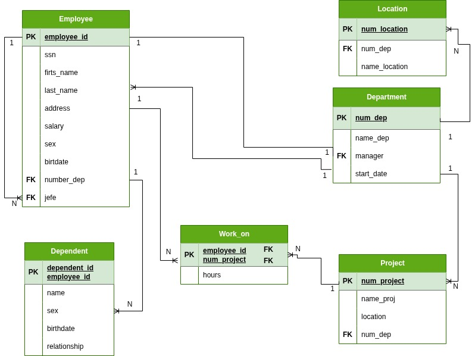

# Diccionario de Datos de la BD Hospital

## 1. Información General

| Elemento | Valor |
| :--- | :--- |
|Proyecto|Company v2|
|Version|1.0|
|Fecha|Julio 2026|
|Elaboro|Jose Domingo Sarabia Hernandez|
|SGBD|SQLServer|

## 2. Descripción del Sistema de Base de Datos

El sistema administra la estructura organizacional y de control de nómina de la corporación. Controla la asignación de empleados a departamentos, locaciones físicas y células operativas de proyectos de ingeniería. 

A diferencia de versiones previas, este esquema optimiza el rendimiento de la indexación física (Clustered Index) implementando llaves primarias sustitutas de tipo numérico entero (`employee_id`), relegando el Número de Seguridad Social (`ssn`) como un atributo de verificación único de negocio y simplificando las llaves foráneas de las entidades dependientes.

## 3. Catalogo de restricciones utilizadas

| Codigo | Significado |
| :--- | :--- |
|PK|PRIMARY KEY|
|FK|FOREIGN KEY|
|NN|NOT NULL|
|UQ|UNIQUE|
|AI|AUTO INCREMENT|
|CK|CHECK|
|DF|DEFAULT|

## 4 Diccionario de Datos

### Tabla: Employee
**Descripción:** Tabla que detalla las caracteristicas de un empleado de una empresa
| Campo | Tipo | Longitud | Restricciones | Descripción |
| :--- | :--- | :--- | :--- | :--- |
| **employee_id** | INT | - | PK, AI, NN | Identificador único interno autoincremental del empleado. |
| **ssn** | VARCHAR | 15 | UQ, NN | Número de seguridad social (Clave de seguro único). |
| **firts_name** | VARCHAR | 50 | NN | Nombre de pila del colaborador. |
| **last_name** | VARCHAR | 50 | NN | Apellidos del colaborador. |
| **address** | VARCHAR | 150 | NULL | Domicilio completo registrado. |
| **salary** | DECIMAL | 10,2 | NN, CK(>0) | Salario percibido mensual. |
| **sex** | CHAR | 1 | NN, CK('M','F')| Identificador de género biológico. |
| **birtdate** | DATE | - | NN | Fecha de nacimiento. |
| **number_dep** | INT | - | FK, NN | ID numérico del departamento al que pertenece. |
| **jefe** | INT | - | FK, NULL | ID numérico del jefe inmediato superior (Recursivo). |

### Tabla: Department
**Descripción:** Tabla que detalla las caracteristicas de un departamento de una empresa

| Campo | Tipo | Longitud | Restricciones | Descripción |
| :--- | :--- | :--- | :--- | :--- |
| **num_dep** | INT | - | PK, NN | Número identificador único de control de la división. |
| **name_dep** | VARCHAR | 50 | UQ, NN | Nombre del departamento (e.g., 'Sistemas', 'Finanzas'). |
| **manager** | INT | - | FK, NN | ID numérico (`employee_id`) del empleado con rol de mánager. |
| **start_date** | DATE | - | NN, DF(GETDATE())| Fecha de asignación en la gerencia corporativa. |

### Tabla: Location
**Descripción:** Tabla que detalla las caracteristicas de una localización de un departamento

| Campo | Tipo | Longitud | Restricciones | Descripción |
| :--- | :--- | :--- | :--- | :--- |
| **num_location** | INT | - | PK, NN | Identificador numérico de la locación física. |
| **num_dep** | INT | - | PK, FK, NN | ID del departamento asignado a esa ubicación. |
| **name_location** | VARCHAR | 100 | NN | Dirección o nombre de la sede geográfica. |

### Tabla: Project
**Descripción:** Tabla que detalla las caracteristicas de un proyecto

| Campo | Tipo | Longitud | Restricciones | Descripción |
| :--- | :--- | :--- | :--- | :--- |
| **num_project** | INT | - | PK, NN | Número único de control asignado al proyecto. |
| **name_proj** | VARCHAR | 100 | UQ, NN | Título oficial de la investigación o desarrollo. |
| **location** | VARCHAR | 100 | NN | Ciudad o locación donde se ejecuta el proyecto. |
| **num_dep** | INT | - | FK, NN | Código del departamento que financia el presupuesto. |

### Tabla: Work_on
**Descripción:** Tabla que contiene una relación entre `Employee` y `Project`

| Campo | Tipo | Longitud | Restricciones | Descripción |
| :--- | :--- | :--- | :--- | :--- |
| **employee_id** | INT | - | PK, FK, NN | ID numérico del empleado colaborador. |
| **num_project** | INT | - | PK, FK, NN | ID numérico del proyecto asignado. |
| **hours** | DECIMAL | 5,2 | NULL, CK(>=0) | Registro de horas semanales aportadas por el empleado. |

### Tabla: Dependent
**Descripción:** Tabla que contiene las caracteristicas de un dependiente de un `Employee`

| Campo | Tipo | Longitud | Restricciones | Descripción |
| :--- | :--- | :--- | :--- | :--- |
| **dependent_id** | INT | - | PK, AI, NN | Llave sustituta de control interno del beneficiario. |
| **employee_id** | INT | - | PK, FK, NN | ID del empleado titular que extiende las prestaciones. |
| **name** | VARCHAR | 100 | NN | Nombre completo de la persona dependiente. |
| **sex** | CHAR | 1 | NN, CK('M','F')| Género del familiar dependiente. |
| **birthdate** | DATE | - | NN | Fecha de nacimiento del dependiente. |
| **relationship** | VARCHAR | 30 | NN | Parentesco formal (Cónyuge, Hijo/a, Padre/Madre). |

---

## 5. Relaciones de la Base de Datos
| Entidad Origen | Entidad Destino | Cardinalidad | Descripción |
| :--- | :--- | :--- | :--- |
| Employee (Jefe) | Employee (Subordinado)| 1:N | Un mánager central coordina el flujo de N colaboradores subordinados. |
| Department | Employee | 1:N | Un departamento integra la fuerza de trabajo de muchos empleados. |
| Department | Location | 1:N | Un departamento corporativo puede expandirse y ubicarse en N sedes. |
| Department | Project | 1:N | Un departamento coordina el portafolio de N proyectos activos. |
| Employee | Work_on | 1:N | Un empleado se subdivide y labora en diferentes proyectos a la vez. |
| Project | Work_on | 1:N | Un proyecto desglosa las horas-hombre de múltiples colaboradores. |
| Employee | Dependent | 1:N | Un colaborador puede registrar ante la base a varios beneficiarios. |

---

## 6. Matriz de Claves Foráneas
| Tabla Origen (Hijo) | Campo FK | Tabla Destino (Padre) | Campo PK |
| :--- | :--- | :--- | :--- |
| Employee | jefe | Employee | employee_id |
| Employee | number_dep | Department | num_dep |
| Department | manager | Employee | employee_id |
| Location | num_dep | Department | num_dep |
| Project | num_dep | Department | num_dep |
| Work_on | employee_id | Employee | employee_id |
| Work_on | num_project | Project | num_project |
| Dependent | employee_id | Employee | employee_id |

---

## 7. Integridad Referencial
| Código | Regla |
| :--- | :--- |
| **IR-01** | La eliminación de un registro en `Employee` y de sus dependencias en las tablas transaccionales `Work_on` y familiares en `Dependent`. |
| **IR-02:** | Se impide dar de baja un departamento de la tabla `Department` si este se halla en uso o mapeado dentro de la asignación geográfica de la tabla `Location`.|
| **IR-03:** | Si un `Project` se cancela o se elimina, los renglones correspondientes a las bitácoras de horas trabajadas en `Work_on` se deben limpiar automáticamente.|

---

## 8. Reglas del Negocio
| Código | Regla |
| :--- | :--- |
| **RN-01:** | La clave primaria sustituta `employee_id` es manejada de forma interna por el SGBD y nunca será editable por los usuarios del sistema operativo.|
| **RN-02:** | El `ssn` corporativo no admite nulos ni duplicados bajo ningún escenario (`UQ`), sirviendo como llave alterna de auditoría.|
| **RN-03:** | El dominio para la columna `relationship` en la base de datos queda cerrado exclusivamente a los valores: 'Son', 'Daughter', 'Spouse', 'Father', 'Mother'.|

## 9. Diagrama Relacional

